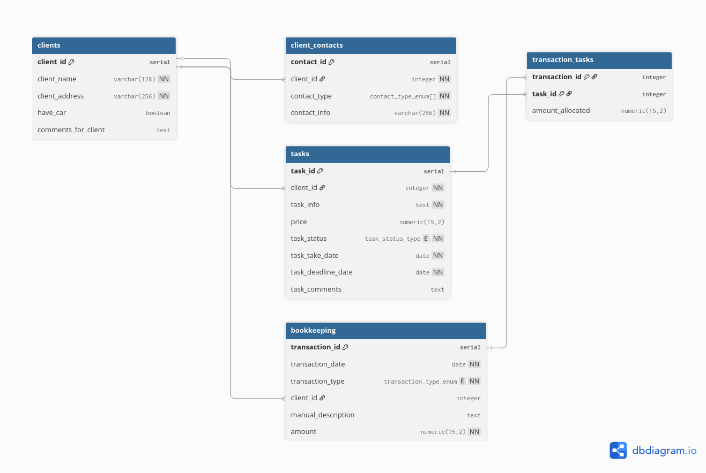

# PrettySmallCRM - PostgreSQL Database Schema

A compact CRM database template designed for freelancers or sole proprietors, optimized for PostgreSQL.

## Features

### Database Structure
1. **Clients**: Stores core client data. A composite `UNIQUE` constraint on `client_name` and `client_address` ensures data integrity, distinguishing between clients with the same name or those residing at the same address.
2. **Client Contacts**: Linked to clients. Uses a custom `contact_type_enum[]` (Array) to store multiple contact methods (e.g., WhatsApp, Viber, Phone) in a single record if they share the same identifier.
3. **Tasks**: Track work items with price, deadlines, and a custom `task_status_type` (`WAITING`, `PROGRESS`, `DONE`).
4. **Bookkeeping**: Financial tracking for income (DEBIT) and expenses (CREDIT). Supports manual descriptions for expense tracking and is linked to clients.
5. **Transaction Tasks**: A junction table implementing a **many-to-many** relationship between transactions and tasks. This allows for precise tracking of partial payments, deposits, or single payments covering multiple tasks.

## Getting Started

### Prerequisites
* PostgreSQL 13+
* pgAdmin 4 (optional) or psql CLI

### Installation
1. Create a new database:
    ```sql
    CREATE DATABASE your_crm_name;
2. Apply the schema:
    ```bash
    psql -d your_crm_name -f prettysmallcrm/pscrm_db/01_schema.sql
3. (Optional) Populate with seed data for testing:
    ```bash
    psql -d your_crm_name -f prettysmallcrm/pscrm_db/02_seed.sql

## Entity-Relationship Diagram (ERD)


## Contact
For any questions, feel free to reach out via email: 4m0n.ra.666@gmail.com